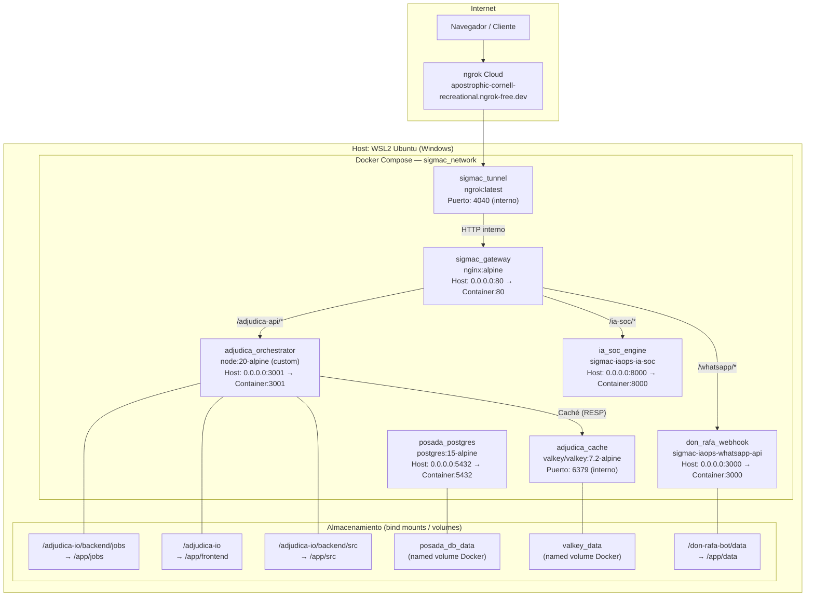

# Sigmac IAOps — Solución de Contenedores Docker

> **Stack:** Docker + Docker Compose | **Host:** WSL2 Ubuntu (Windows) | **Fecha:** Mayo 2026

---

## Tabla de Contenidos

1. [Visión General del Stack](#1-visión-general-del-stack)
2. [Diagrama de Infraestructura](#2-diagrama-de-infraestructura)
3. [Containers Activos](#3-containers-activos)
4. [Docker Compose — Configuración Completa](#4-docker-compose--configuración-completa)
5. [Dockerfile — Adjudica.IO Orchestrator](#5-dockerfile--adjudicaio-orchestrator)
6. [Red y Puertos](#6-red-y-puertos)
7. [Volúmenes Persistentes](#7-volúmenes-persistentes)
8. [Variables de Entorno](#8-variables-de-entorno)
9. [Estado Actual del Sistema](#9-estado-actual-del-sistema)
10. [Guía de Operaciones](#10-guía-de-operaciones)

---

## 1. Visión General del Stack

La infraestructura corre completamente en **Docker sobre WSL2 Ubuntu** en la máquina local. Un solo `docker-compose.yml` orquesta **6 servicios** que comparten una red interna `sigmac_network`.

El acceso público se gestiona a través de **ngrok**, que crea un túnel HTTPS desde internet hacia el Nginx Gateway interno, eliminando la necesidad de IP pública o configuración de router.

### Proyectos alojados

| Proyecto | Propósito | Container |
|---------|-----------|-----------|
| **Adjudica.IO** | Análisis IA de licitaciones | `adjudica_orchestrator` |
| **Adjudica.IO Caché** | Caché en memoria Valkey | `adjudica_cache` |
| **IA-SOC** | Motor de inteligencia de seguridad 24/7 | `ia_soc_engine` |
| **Don Rafa Bot** | WhatsApp chatbot con webhook | `don_rafa_webhook` |
| **Posada Camelinas DB** | Base de datos del hotel | `posada_postgres` |

---

## 2. Diagrama de Infraestructura



---

## 3. Containers Activos

Estado capturado en vivo el **2026-06-05**:

| Container | Imagen | Estado | Uptime | Puertos |
|-----------|--------|--------|--------|---------|
| `adjudica_orchestrator` | `sigmac-iaops-adjudica-orchestrator` | ✅ Up (healthy) | 3 días | `0.0.0.0:3001→3001/tcp` |
| `adjudica_cache` | `valkey/valkey:7.2-alpine` | ✅ Up (healthy) | 2 días | Puerto interno (6379) |
| `posada_postgres` | `postgres:15-alpine` | ✅ Up | 4 días | `0.0.0.0:5432→5432/tcp` |
| `ia_soc_engine` | `sigmac-iaops-ia-soc` | ✅ Up | 4 días | `0.0.0.0:8000→8000/tcp` |
| `don_rafa_webhook` | `sigmac-iaops-whatsapp-api` | ✅ Up | 4 días | `0.0.0.0:3000→3000/tcp` |
| `sigmac_gateway` | `nginx:alpine` | ✅ Up | 4 días | `0.0.0.0:80→80/tcp` |
| `sigmac_tunnel` | `ngrok/ngrok:latest` | ✅ Up | 4 días | `4040/tcp` (interno) |

### Recursos en tiempo real (`adjudica_orchestrator` + `adjudica_cache`)
```
adjudica_orchestrator:
  CPU:    1.25%
  MEM:    54.20 MiB / 7.699 GiB  (0.69%)
adjudica_cache:
  CPU:    0.05%
  MEM:    4.12 MiB / 7.699 GiB   (0.05%)
```

---

## 4. Docker Compose — Configuración Completa

**Ruta:** `/home/edgar/Sigmac-IAOps/docker-compose.yml`

```yaml
services:

  # ─── INFRAESTRUCTURA DE ACCESO (NGROK) ─────────────────────────────────────
  ngrok:
    image: ngrok/ngrok:latest
    container_name: sigmac_tunnel
    restart: always
    environment:
      - NGROK_AUTHTOKEN=${NGROK_TOKEN}
    command:
      - "http"
      - "--url=${NGROK_DOMAIN}"
      - "sigmac_gateway:80"
    networks:
      - sigmac_network
    depends_on:
      - nginx

  # ─── EL DIRECTOR DE TRÁFICO (NGINX API GATEWAY) ────────────────────────────
  nginx:
    image: nginx:alpine
    container_name: sigmac_gateway
    restart: always
    ports:
      - "80:80"
    volumes:
      - ./nginx/nginx.conf:/etc/nginx/nginx.conf:ro
    networks:
      - sigmac_network
    depends_on:
      - ia-soc
      - whatsapp-api
      - adjudica-orchestrator

  # ─── PROYECTO 1: IA-SOC (EL CEREBRO 24/7) ──────────────────────────────────
  ia-soc:
    build: ./ia-soc
    container_name: ia_soc_engine
    restart: always
    stdin_open: true
    tty: true
    ports:
      - "8000:8000"
    env_file:
      - .env
    networks:
      - sigmac_network

  # ─── PROYECTO 2: DON RAFA WHATSAPP BOT ─────────────────────────────────────
  whatsapp-api:
    build:
      context: ./don-rafa-bot
      dockerfile: Dockerfile
    container_name: don_rafa_webhook
    restart: unless-stopped
    ports:
      - "3000:3000"
    env_file:
      - ./don-rafa-bot/.env
    volumes:
      - ./don-rafa-bot/data:/app/data
    networks:
      - sigmac_network

  # ─── PROYECTO 3: ADJUDICA.IO ORCHESTRATOR ──────────────────────────────────
  adjudica-orchestrator:
    build:
      context: ./adjudica-io/backend
      dockerfile: Dockerfile
    container_name: adjudica_orchestrator
    restart: unless-stopped
    ports:
      - "3001:3001"
    env_file:
      - .env
    volumes:
      # Persistent job storage
      - ./adjudica-io/backend/jobs:/app/jobs
      # Frontend files served as static assets
      - ./adjudica-io:/app/frontend
      # Backend src: templates persisten sin docker cp (hot-reload)
      - ./adjudica-io/backend/src:/app/src
    networks:
      - sigmac_network
    depends_on:
      - adjudica-cache
    extra_hosts:
      - "host.docker.internal:host-gateway"

  # ─── PROYECTO 4: BASE DE DATOS POSADA CAMELINAS ────────────────────────────
  posada-db:
    image: postgres:15-alpine
    container_name: posada_postgres
    restart: unless-stopped
    environment:
      POSTGRES_USER: camelinas_admin
      POSTGRES_PASSWORD: camelinas_secret_dev
      POSTGRES_DB: camelinas_db
    ports:
      - "5432:5432"
    networks:
      - sigmac_network
    volumes:
      - posada_db_data:/var/lib/postgresql/data

  # ─── PROYECTO 5: ADJUDICA CACHE (VALKEY IN-MEMORY) ────────────────────────────
  adjudica-cache:
    image: valkey/valkey:7.2-alpine
    container_name: adjudica_cache
    restart: unless-stopped
    networks:
      - sigmac_network
    volumes:
      - valkey_data:/data
    command: valkey-server --save 60 1 --loglevel warning --maxmemory 256mb --maxmemory-policy allkeys-lru
    healthcheck:
      test: ["CMD", "valkey-cli", "ping"]
      interval: 10s
      timeout: 3s
      retries: 3

# ─── VOLÚMENES NOMBRADOS ────────────────────────────────────────────────────
volumes:
  posada_db_data:
  valkey_data:

# ─── RED COMPARTIDA ─────────────────────────────────────────────────────────
networks:
  sigmac_network:
    external: true
    name: sigmac-iaops_sigmac_network
```

---

## 5. Dockerfile — Adjudica.IO Orchestrator

**Ruta:** `/home/edgar/Sigmac-IAOps/adjudica-io/backend/Dockerfile`

```dockerfile
FROM node:20-alpine

WORKDIR /app

# ── Instalar dependencias (aprovecha Docker layer cache) ──────────────────────
# Se copia solo package.json primero para que npm install no se repita
# si solo cambia el código fuente
COPY package.json ./
RUN npm install --omit=dev         # Sin devDependencies en producción

# ── Copiar código fuente ──────────────────────────────────────────────────────
# .env NO se copia — se inyecta en runtime via docker-compose env_file
COPY src/ ./src/

# ── Directorios persistentes ──────────────────────────────────────────────────
# Estos son sobreescritos por los bind mounts en docker-compose
RUN mkdir -p /app/jobs /app/uploads

# ── Puerto expuesto ───────────────────────────────────────────────────────────
EXPOSE 3001

# ── Health check automático ───────────────────────────────────────────────────
# Docker marca el container como "healthy" o "unhealthy"
# Nginx puede usar esto para routing inteligente
HEALTHCHECK --interval=30s --timeout=10s --start-period=5s --retries=3 \
  CMD wget -qO- http://localhost:3001/health || exit 1

# ── Comando de inicio ─────────────────────────────────────────────────────────
CMD ["node", "src/index.js"]
```

### Por qué `node:20-alpine`

| Característica | Valor |
|---------------|-------|
| Tamaño imagen base | ~180MB (vs ~900MB en `node:20`) |
| Runtime | Node.js 20 LTS (Long Term Support) |
| OS | Alpine Linux 3.x (musl libc) |
| Herramienta de salud | `wget` (incluido en Alpine) |

### 📦 Footprint de Dependencias para Generación Word (.docx)
*   **Aislamiento y Ligereza:** El motor de generación de Word de anexos (`word.service.js`) fue diseñado intencionalmente utilizando librerías 100% de Javascript (`pizzip` y `docxtemplater`).
*   **Sin Binarios del Sistema:** A diferencia de otros sistemas de software que requieren instalar paquetes pesados como **LibreOffice**, **Pandoc** o runtimes compilados de C/Python en el sistema operativo del contenedor, la solución en Adjudica.IO corre nativamente sobre Node.js 20.
*   **Impacto de Almacenamiento Cero:** Gracias a esta decisión de diseño, la imagen del contenedor `adjudica_orchestrator` se mantuvo en su peso óptimo de **~180MB**, en lugar de escalar a más de 1.2GB, optimizando el tiempo de construcción (*build*), la descarga y el despliegue en producción.

---

## 6. Red y Puertos

### Red Docker: `sigmac_network`

```
Tipo: Bridge (external, pre-creada)
Nombre real: sigmac-iaops_sigmac_network
Network ID: 3b63479674d8
```

### Mapa de puertos

```
┌─────────────────────────────────────────────────────────────┐
│  HOST (WSL2)              →  CONTAINER                       │
├──────────────┬────────────┬────────────────────────────────  │
│  Puerto Host │ Container  │ Servicio                         │
├──────────────┼────────────┼─────────────────────────────────┤
│  :80         │ :80        │ Nginx Gateway (sigmac_gateway)   │
│  :3000       │ :3000      │ Don Rafa WhatsApp Bot            │
│  :3001       │ :3001      │ Adjudica.IO Orchestrator         │
│  :4040       │ :4040      │ ngrok Web UI (interno)           │
│  :5432       │ :5432      │ PostgreSQL (Posada Camelinas)    │
│  :8000       │ :8000      │ IA-SOC Engine                    │
└──────────────┴────────────┴─────────────────────────────────┘
```

### Acceso externo vía ngrok

```
Internet → ngrok Cloud → sigmac_tunnel → sigmac_gateway:80 → servicios internos

URL pública: https://apostrophic-cornell-recreational.ngrok-free.dev
```

### Routing Nginx (inferido)

| Path externo | Proxied a |
|-------------|-----------|
| `/adjudica-api/*` | `adjudica_orchestrator:3001` |
| `/*` (raíz) | `adjudica_orchestrator:3001` (frontend + API) |

---

## 7. Volúmenes Persistentes

### Bind Mounts — Adjudica.IO

Los bind mounts permiten que los cambios en el host se reflejen inmediatamente en el container **sin necesidad de rebuild**:

| Ruta en Host | Ruta en Container | Propósito |
|-------------|------------------|-----------|
| `./adjudica-io/backend/jobs` | `/app/jobs` | Jobs, viabilidad.html, dashboard.html — **datos del negocio** |
| `./adjudica-io` | `/app/frontend` | HTML/CSS/JS del frontend — editable en vivo |
| `./adjudica-io/backend/src` | `/app/src` | Código Node.js — hot-reload sin rebuild |

> **Truco clave:** Al montar `/app/src`, cualquier cambio en los archivos `.js` del backend (templates, servicios, rutas) se aplica inmediatamente reiniciando el proceso Node (o en el siguiente request si no usa nodemon).

### Estructura de Aislamiento Multi-Usuario en `/app/jobs`
Para garantizar que la información de los diferentes licitantes permanezca físicamente separada e inaccesible entre sí, el volumen persistente de jobs estructura los datos corporativos de la siguiente manera:
*   **Perfiles Corporativos:** `/app/jobs/db/perfiles/perfil_${safeEmail}.json` (JSON estructurado de la empresa).
*   **Documentos de Cumplimiento:** `/app/jobs/db/documentos/${safeEmail}/` (SAT, IMSS, INFONAVIT, Acta Constitutiva en PDF).
*   *Lógica de Sanitización:* `${safeEmail}` es el email del usuario con caracteres no alfanuméricos reemplazados por guiones bajos (ej. `edgar_real_sigmac_com_mx`), previniendo ataques de Path Traversal y colisiones de directorios.

### Bind Mount — Don Rafa Bot

| Ruta en Host | Ruta en Container | Propósito |
|-------------|------------------|-----------|
| `./don-rafa-bot/data` | `/app/data` | Conversaciones y estado del bot |

### Named Volume — PostgreSQL

| Volume | Ruta en Container | Propósito |
|--------|------------------|-----------|
| `posada_db_data` | `/var/lib/postgresql/data` | Datos de la BD (sobreviven `docker-compose down`) |

### Named Volume — Valkey (Capa In-Memory)

| Volume | Ruta en Container | Propósito |
|--------|------------------|-----------|
| `valkey_data` | `/data` | Persistencia en RAM y volcado a disco de Valkey (sobrevive `docker-compose down`) |

#### Llaves de Caché Utilizadas y TTLs en `adjudica_cache`:
El microservicio `adjudica_orchestrator` utiliza Valkey para evitar cuellos de botella de disco e I/O, gestionando las siguientes llaves:
*   `job:{jobId}:status` (Hash): Estado operativo y metadatos de los jobs. **TTL:** 7 días (604,800s).
*   `idem:{sha256Hash}` (String): Hash SHA-256 de las bases de licitación para evitar subidas y ejecuciones duplicadas de Azure/Gemini. **TTL:** 30 días (2,592,000s).
*   `session:{email}` (String): Hash del token JWT activo del usuario para control y revocación inmediata de accesos. **TTL:** 7 días.
*   `perfil:${safeEmail}:licitante` (String): JSON serializado de "Mi Empresa". **TTL:** 1 hora (3,600s).
*   `perfil:${safeEmail}:job:${jobId}:alcance_real` (String): Matriz serializada de Alcance Real mutado tras Junta de Aclaraciones. **TTL:** 1 hora (3,600s).
*   `nlm:lock` (String): Candado de exclusión mutua (mutex lock) para la API MCP de NotebookLM. **TTL:** 10 minutos (600s).

> **Diferencia importante:**
> - **Bind mount** = directorio del host (visible en el filesystem)
> - **Named volume** = gestionado por Docker (invisible en el host, más eficiente para BD)

---

## 8. Variables de Entorno

Las variables se inyectan desde dos fuentes:

### `.env` compartido del stack

```env
# ── ngrok ─────────────────────────────────────────────────────
NGROK_TOKEN=...
NGROK_DOMAIN=apostrophic-cornell-recreational.ngrok-free.dev

# ── Adjudica.IO ───────────────────────────────────────────────
GEMINI_API_KEY=...
ADJUDICA_JWT_SECRET=...
ADJUDICA_GOOGLE_CLIENT_ID=625399507015-ordofgt88rveq8h5v59mkj9fnemp30ko.apps.googleusercontent.com
ADJUDICA_ADMIN_EMAIL=ragde83@gmail.com
ADJUDICA_PORT=3001
ADJUDICA_ALLOWED_ORIGINS=*
ADJUDICA_MODEL_VIABILIDAD=gemini-2.5-pro
ADJUDICA_MODEL_DASHBOARD=gemini-2.5-flash
ADJUDICA_MODEL_SPA_RENDERER=gemini-2.5-flash
ADJUDICA_INTERNAL_API_KEY=...
PIN_MAESTRO=041183

# ── Node.js runtime (auto-inyectadas por imagen) ──────────────
NODE_VERSION=20.20.2
```

### `.env` propio de Don Rafa Bot

```env
# Variables específicas del WhatsApp bot
# (independiente del .env del stack)
```

### Buenas prácticas aplicadas

- ✅ El `.env` **no se copia** en la imagen Docker (está en `.gitignore`)
- ✅ Secretos inyectados en runtime vía `env_file`, no en el `Dockerfile`
- ✅ `ADJUDICA_WHITELIST_PATH` apunta al volumen `/app/jobs/authorized_emails.json`
- ✅ El `MASTER_ADMIN` está en variable de entorno, no hardcodeado en código

---

## 9. Estado Actual del Sistema

### Health Check de Adjudica.IO

```
GET http://localhost:3001/health

{
  "status": "ok",
  "service": "adjudica-orchestrator",
  "version": "1.0.0",
  "timestamp": "2026-05-31T..."
}
```

Docker verifica este endpoint automáticamente cada **30 segundos**:
- ✅ `healthy` → container responde en < 10s
- ❌ `unhealthy` → falla 3 reintentos → Docker puede reiniciar automáticamente

### Métricas del Sistema (capturadas 2026-05-31)

| Métrica | Valor |
|---------|-------|
| Total de análisis realizados | **47** |
| Análisis completados | **14** (30% tasa de éxito) |
| Con veredicto GO | **9** |
| Con veredicto NO-GO | **3** |
| Usuarios activos | **1** |
| Último login | `ragde83@gmail.com` — 2026-05-28 |

### Uptime del Stack

```
sigmac_tunnel       → 4 días corriendo
sigmac_gateway      → 4 días corriendo
ia_soc_engine       → 4 días corriendo
don_rafa_webhook    → 4 días corriendo
posada_postgres     → 4 días corriendo
adjudica_orchestrator → 3 días corriendo (reiniciado el 2026-05-28)
```

---

## 10. Guía de Operaciones

### Iniciar el stack completo

```bash
cd /home/edgar/Sigmac-IAOps
docker compose up -d
```

### Detener sin perder datos

```bash
docker compose stop        # Detiene, no elimina containers
docker compose down        # Detiene y elimina containers (volúmenes se conservan)
```

> ⚠️ `docker compose down -v` elimina los named volumes (¡BD de PostgreSQL!)

### Rebuild de un servicio específico

```bash
# Solo Adjudica.IO (cuando cambia Dockerfile o package.json)
docker compose build adjudica-orchestrator
docker compose up -d adjudica-orchestrator

# Rebuild con no-cache (si hay problemas de capas)
docker compose build --no-cache adjudica-orchestrator
```

### Ver logs en tiempo real

```bash
# Todo el stack
docker compose logs -f

# Solo Adjudica.IO
docker logs -f adjudica_orchestrator

# Últimas 100 líneas
docker logs --tail 100 adjudica_orchestrator
```

### Ejecutar comandos dentro del container

```bash
# Shell interactivo
docker exec -it adjudica_orchestrator sh

# Ejecutar script Node.js
docker exec adjudica_orchestrator node /app/jobs/mi_script.js

# Verificar health manualmente
docker exec adjudica_orchestrator wget -qO- http://localhost:3001/health
```

### Actualizar código sin rebuild

Gracias al bind mount `/app/src`, los cambios en `e:/Antigravity/adjudica-io/backend/src/` se reflejan inmediatamente en el container. Solo se necesita reiniciar Node.js:

```bash
docker restart adjudica_orchestrator
```

### Backup de datos del negocio

```bash
# Backup de todos los jobs (análisis realizados)
cp -r /home/edgar/Sigmac-IAOps/adjudica-io/backend/jobs ~/backup_jobs_$(date +%Y%m%d)

# Backup de la BD PostgreSQL
docker exec posada_postgres pg_dump -U camelinas_admin camelinas_db > ~/backup_db_$(date +%Y%m%d).sql
```

### Verificar red interna

```bash
# Listar containers en la red
docker network inspect sigmac-iaops_sigmac_network

# Ping entre containers (desde adjudica al nginx)
docker exec adjudica_orchestrator ping -c 3 sigmac_gateway
```

### Regenerar Reporte de Viabilidad manualmente

```bash
# Dentro del container, regenerar el HTML de un job específico
docker exec adjudica_orchestrator sh /app/jobs/regen_viabilidad.sh
```

### Monitoreo Continuo del Stack (`monitor.js` via Crontab WSL2)

Para garantizar la continuidad operativa sin agotar la cuota de la API de la IA (`RESOURCE_EXHAUSTED 429`), se ha sustituido el programador de IA por una tarea programada crontab nativa en el host WSL2 (Ubuntu). Esta tarea ejecuta un script ligero en Node.js localizado en `/home/edgar/Sigmac-IAOps/adjudica-io/monitor.js` cada **5 minutos** de forma indefinida.

#### A. Comandos de Verificación Ejecutados por el Script
El script de monitoreo realiza de forma secuencial y estructurada las siguientes validaciones sobre el host y los contenedores:

1. **Estado de Contenedores de Orquestación y Caché (`docker inspect`):**
   Inspecciona las propiedades de ejecución y salud de los contenedores Docker mediante llamadas al daemon Docker de WSL:
   ```bash
   docker inspect adjudica_orchestrator --format '{{.State.Status}} ({{.State.Health.Status}})'
   docker inspect adjudica_cache --format '{{.State.Status}} ({{.State.Health.Status}})'
   ```
   Valores esperados: `running (healthy)`.

2. **Salud del Backend HTTP (Express `/health`):**
   Realiza una consulta HTTP directa al endpoint interno para certificar la respuesta del orquestador Node.js:
   ```bash
   curl -i -s http://localhost:3001/health
   ```
   Valores esperados: Código de estado `200 OK` con un payload JSON conteniendo `"status": "ok"`.

3. **Verificación de Túneles Activos (Proceso ngrok en WSL):**
   Valida que el proceso del túnel de ngrok esté levantado en el host de WSL2 para permitir el tráfico externo desde el frontend en Hostgator:
   ```bash
   ps aux | grep ngrok
   ```
   Se verifica la correspondencia del túnel apuntando a la dirección del gateway local `sigmac_gateway:80` y utilizando la URL asignada.

#### B. Destino del Reporte de Monitoreo
Toda la salida de diagnóstico es procesada y estructurada por `monitor.js` para generar el reporte de estatus global localmente y copiarlo automáticamente hacia el path de Windows:
* **Archivo Destino:** [monitoring_status.md](file:///E:/Antigravity/adjudica-io/monitoring_status.md)

Este reporte provee una matriz semáforo en tiempo real de todos los componentes activos, su uptime y notas de auditoría.

#### C. Guía de Remediación (SOP - Standard Operating Procedure)

##### Remediación Automática (Acción del Monitor)
El sistema está diseñado de tal forma que los contenedores que cuenten con la directiva `restart: unless-stopped` en el `docker-compose.yml` se reinicien automáticamente si el demonio de Docker detecta un crash a nivel de sistema operativo del contenedor. 
Adicionalmente, el healthcheck de Docker (`HEALTHCHECK` configurado en el `Dockerfile` del orquestador) evalúa el servicio cada 30 segundos, marcando el contenedor como `unhealthy` si falla de manera persistente, notificando a la capa de enrutamiento.

##### Remediación Manual (Acciones del Operador)
Si en el reporte de [monitoring_status.md](file:///E:/Antigravity/adjudica-io/monitoring_status.md) se reporta algún servicio con el estado `❌` o `unhealthy`, siga este árbol de remediación:

1. **Orquestador o Caché Inactivos:**
   Si `adjudica_orchestrator` o `adjudica_cache` no están en estado `running`:
   ```bash
   # Iniciar/Reiniciar el contenedor caído
   docker compose restart adjudica-orchestrator
   docker compose restart adjudica-cache
   ```

2. **Endpoint `/health` no responde (pero contenedor está corriendo):**
   Esto indica un bloqueo en el loop de eventos de Node.js o una falla de conexión interna:
   ```bash
   # Revisar logs del contenedor para identificar fallos o cuellos de botella
   docker compose logs --tail 100 adjudica-orchestrator
   # Forzar reinicio del orquestador
   docker compose restart adjudica-orchestrator
   ```

3. **Proceso de ngrok caído o Dominio Inaccesible:**
   Si el tráfico externo no llega al frontend (error de conexión con la API):
   ```bash
   # Verificar si el contenedor de ngrok está corriendo
   docker inspect sigmac_tunnel --format '{{.State.Status}}'
   # Si está caído, levantarlo
   docker compose restart ngrok
   # Si se utiliza ngrok nativo en WSL2 host y está inactivo, ejecutar:
   nohup ngrok http --url=apostrophic-cornell-recreational.ngrok-free.dev sigmac_gateway:80 > /dev/null 2>&1 &
   ```

---


## Apéndice: Archivos de Configuración Clave

| Archivo | Ruta en Host | Propósito |
|---------|-------------|-----------|
| `docker-compose.yml` | `/home/edgar/Sigmac-IAOps/docker-compose.yml` | Orquestación del stack |
| `Dockerfile` | `/home/edgar/Sigmac-IAOps/adjudica-io/backend/Dockerfile` | Imagen de Adjudica.IO |
| `nginx.conf` | `/home/edgar/Sigmac-IAOps/nginx/nginx.conf` | Routing del gateway |
| `.env` | `/home/edgar/Sigmac-IAOps/.env` | Variables del stack (no en git) |
| `authorized_emails.json` | `.../backend/jobs/authorized_emails.json` | Whitelist de usuarios |

---

*Documentación de infraestructura — Sigmac IAOps — Mayo 2026*
